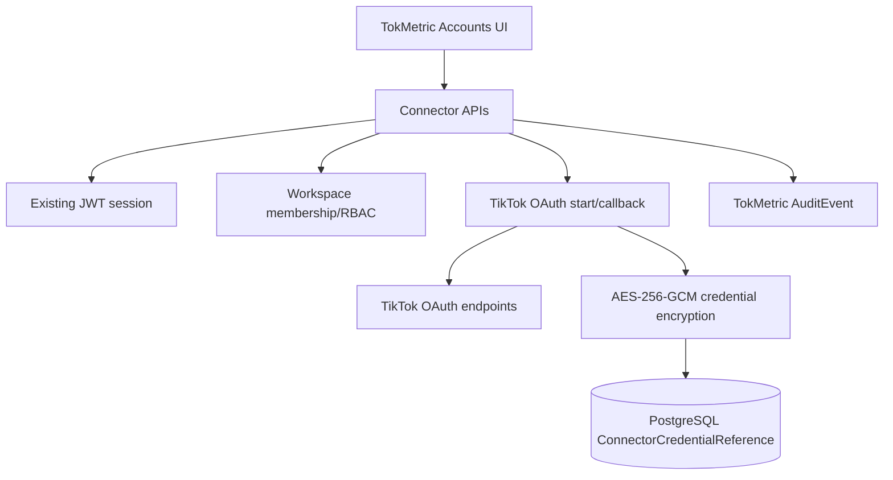

# TokMetric architecture

TokMetric extends the existing GEM Enterprise Next.js application and custom JWT session. The Phase 2 connector architecture separates UI state, OAuth authorization, encrypted credential persistence, and future publishing. Website users authenticate with the existing `gem_session`; GPT bearer authentication is not used for normal website connector operations.

Live publishing is out of scope for Phase 2 and remains disabled.
