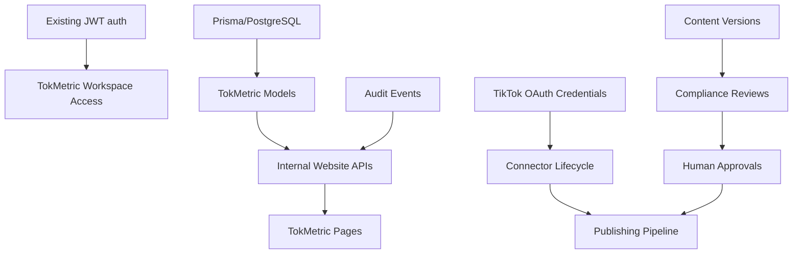
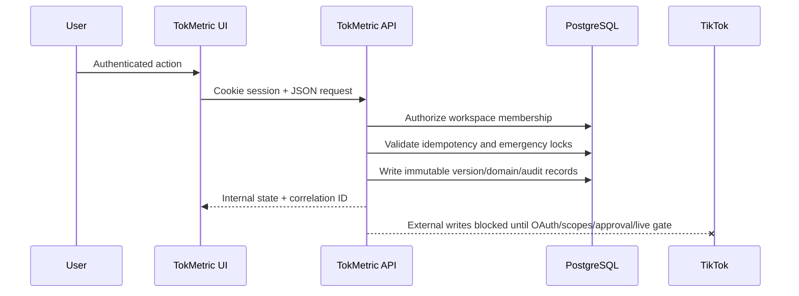

# TokMetric Master Implementation Plan

## Current-state inspection

- Framework: Next.js App Router under `src/app`.
- Language: TypeScript with strict project configuration.
- ORM/database: Prisma 5 targeting PostgreSQL through `POSTGRES_PRISMA_URL` and `POSTGRES_URL_NON_POOLING`.
- Authentication: existing JWT cookie session in `src/lib/auth.ts`; TokMetric must reuse it.
- API pattern: route handlers in `src/app/api/**/route.ts`, Zod validation in existing write APIs.
- Audit: existing `AuditLog` plus TokMetric-specific `AuditEvent` foundation in Phase 1.
- Deployment: Vercel configuration files are present.
- TokMetric routes verified: public product, workspace, review-demo, legal pages, dashboard, accounts, content-studio, compliance, approvals, publishing, analytics, developer.
- Existing TokMetric UI was mostly truthful static readiness/sample state; Phase 1 begins replacing it with persisted internal state and explicit disabled live operations.

## Baseline results captured before Phase 1 changes

| Check | Result | Notes |
| --- | --- | --- |
| `pnpm install --frozen-lockfile` | Pass | Lockfile current. |
| `pnpm exec tsc --noEmit` | Pass | No TypeScript output before lint started. |
| `pnpm lint` | Fails pre-existing | `src/components/store/StorefrontProductGrid.tsx` uses `` and lint treats warnings as errors. |
| `pnpm exec prisma validate` | Fails without env | Missing `POSTGRES_URL_NON_POOLING`; passes when test env values are supplied. |
| `pnpm test` | Pass | 4 test files, 100 tests passed. |

## Eight-phase tracking checklist

### Phase 1 — Backend Foundation and Production Data Model
- [x] Add governance plan and tracking artifacts.
- [x] Add TokMetric production data model and migration.
- [x] Add foundation server utilities for session, authorization, hashing, audit, domain events, idempotency, redaction, errors, and emergency locks.
- [x] Add readiness API backed by database counts.
- [ ] Fully connect all TokMetric pages to authenticated real data.
- [ ] Add exhaustive Phase 1 tests.

### Phase 2 — TikTok OAuth and Connector System
- [x] Provider abstraction.
- [x] OAuth start/callback/state/PKCE/token lifecycle.
- [x] Encrypted token reference persistence.
- [x] Revocation/disconnect/health checks.
- [x] Sandbox fixtures and external blocker reporting.
- [ ] Real TikTok credential verification and product approval.

### Phase 3 — Content, Compliance, Approvals, and Policy Engine
- [ ] Draft/version APIs.
- [ ] Policy engine and versioned policies.
- [ ] Approval binding, expiration, revocation, invalidation.

### Phase 4 — Custom GPT Actions and API Contract
- [ ] Shared-secret GPT bearer auth.
- [ ] Required `/functions/*` endpoints.
- [ ] OpenAPI 3.1 contract.
- [ ] GPT truthfulness controls.

### Phase 5 — Specialized AI Agents
- [ ] Controlled agent modules with schemas.
- [ ] Prompt/model/version/cost/audit tracking.
- [ ] Workspace retrieval and safety evaluations.

### Phase 6 — Media Pipeline and TikTok Publishing
- [ ] Secure media upload lifecycle.
- [ ] Durable job states.
- [ ] Sandbox-first publishing pipeline.
- [ ] No false external success.

### Phase 7 — Enterprise Organizations, Permissions, Billing, Operations
- [ ] Invitations, teams, RBAC refinements.
- [ ] Billing abstractions only; no live billing without credentials.
- [ ] Notifications and admin operations.

### Phase 8 — Security Hardening, Observability, App Review, Launch
- [ ] Threat model, checklists, runbooks.
- [ ] Observability and alerts.
- [ ] TikTok App Review evidence package.
- [ ] Production activation gate with `TOKMETRIC_LIVE_PUBLISHING_ENABLED=false` default.

## Risk register

| Risk | Impact | Mitigation |
| --- | --- | --- |
| TikTok credentials/scopes unavailable | Blocks real OAuth and publishing | Phase 2 code paths are implemented; missing config returns `NOT_CONFIGURED` and Business/Shop remain `PLATFORM_APPROVAL_REQUIRED`. |
| Production secrets unavailable | Blocks token encryption and production callbacks | Use placeholders only; document required env vars. |
| Existing lint warning | Blocks zero-warning lint | Track as unrelated baseline unless changed in scope. |
| No local PostgreSQL | Blocks migration apply verification | Commit Prisma migration SQL and validate schema with supplied env; document limitation. |
| Live publishing accidentally enabled | High | Default disabled; require environment gate and emergency locks. |

## Dependency map

## Data-flow diagram

## Current-state versus target-state

| Area | Current state | Target state |
| --- | --- | --- |
| UI | Public/static truthful readiness screens | Authenticated database-backed workspace with empty/error/permission states. |
| Data | No TokMetric production tables | Multi-tenant immutable model with audit and idempotency. |
| OAuth | Public callback placeholder | Approved OAuth lifecycle with encrypted server-side token references. |
| Publishing | Disabled/not connected | Sandbox-first controlled jobs with distinct internal/external states. |
| GPT Actions | Not wired to production backend | Bearer-protected contract-matched endpoints. |
| AI | No controlled TokMetric agents | Draft-only schema-bound audited agents. |
| App Review | Review demo page exists | Evidence package and verified sandbox flow or truthful blockers. |

## GitHub tracking issue

No GitHub CLI/API credentials are available in this environment. This document is the repository-local tracking issue substitute until a maintainer creates the GitHub issue or provides repository API credentials.
